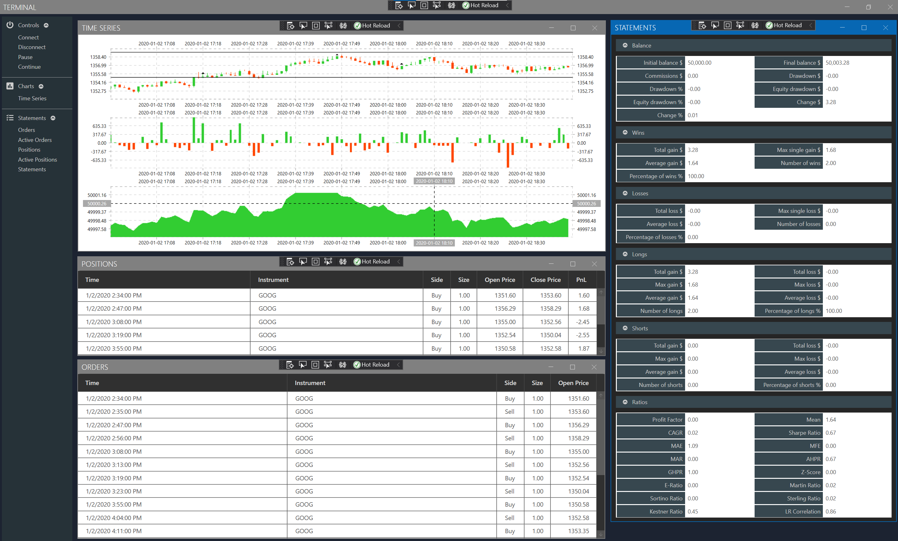

# Stock Trading Terminal and Backtester - Desktop Version

All-in-one. Trading terminal with generic gateway implementation, tick backtester, charting, and performance evaluator for trading strategies.
Currently, supports only stocks with experimental extension for FX, options, and futures. 

# Disclaimer

The app is in active development state and can be updated without any notice.

# Structure

* **Core** - cross-platform .NET 5 class library that contains main functionality 
* **Chart** - graphics and [charts](https://github.com/Indemos/Canvas)
* **Client** - the main application that puts together windows for orders, positions, performance metrics, and charts 
* **Evaluation** - basic unit tests 
* **Score** - class library measuring performance and related statstics
* **Data** - catalog with historical data, any format is acceptable as long as you implement your own parser
* **Gateway** - gateway implementations for variaous brokers and exchanges, including historical and simulated data

# Gateways 

Both, trading and data gateways are included in the same interface. 
In order to create connector for preferable broker, implement interface `IGatewayModel`.

# Trading Strategies

[Examples](https://github.com/Indemos/Terminal/tree/master/Client/Strategies) of simple trading strategies can be found in `Client` catalog.

# Configuration 

In order to connect to specific gateway, you need to provide relevant credentials by using `App.config` file in the `Client` project or directly in the source code. 
Example of the configuration file for `Simulation` gateway below. 

```
<?xml version="1.0" encoding="utf-8" ?>
<configuration>
  <appSettings>
    <add key="DataLocation" value="D:/Code/Net/Terminal/Data/Quotes" />
  </appSettings>
</configuration>
```

Then, in your strategy, when creating `Gateway` instance, initialize it using configuration above. 

```
var gateway = new GatewayClient()
{
  Token = ...
  Secret = ...
  Source = ConfigurationManager.AppSettings["DataLocation"].ToString()
}
```

# Preview 


